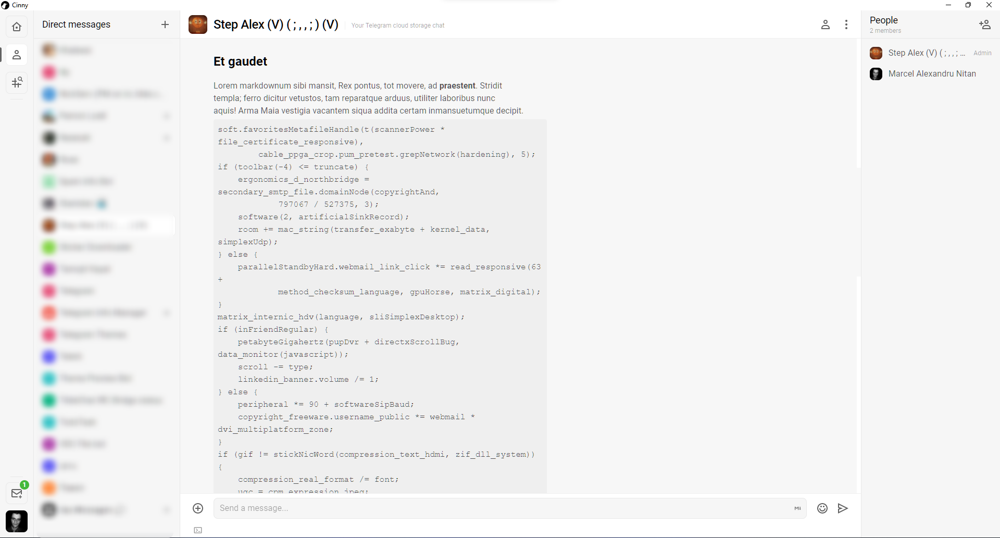

# Cinny Desktop
An unofficial desktop application for the matrix client [Cinny](https://app.cinny.in/) done with electron and nativefier.

## About Cinny:

Cinny is an matrix client build using [Node.js](https://nodejs.org/en/) focusing primarily on simple, elegant and secure interface. 

- Cinny Source Code: https://github.com/ajbura/cinny
- Cinny Website: https://cinny.in/

## Install

- Find latest build in the [releases page](https://github.com/nitanmarcel/CinnyDesktop/releases) where you'll find ready to run executables for Windows, Linux and MacOS.

## Build

- Install [Node.js](https://nodejs.org/en/)
- Clone the repo: `git clone https://github.com/nitanmarcel/CinnyDesktop.git'
- Cd to the cloned repo: `cd CinnyDesktop`
- Install Node.js dependencies: npm install
- Build the application:
    - Windows: `node ./build_win.js`
    - Linux: `node ./build_linux.js`
    - MacOS: `node ./build_mac.js`

## Screenshot

### License

[MIT](LICENSE)